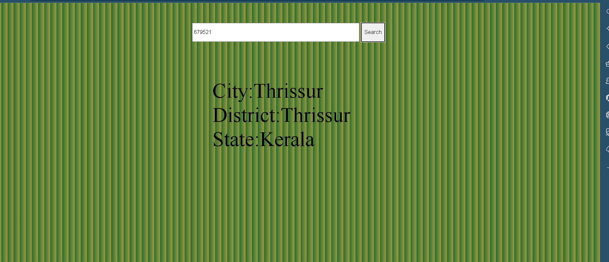

# PinCode-API
You will build an app that allows users to view details of a location by providing zipcode as input. The app further allows users to remove details of previously entered zip codes.

Topics Covered:
JavaScript events, DOM selectors, Promise, callback, etc. Fetch API.

Api Link:
search for it in Rapid Api 

UI : Feel free to design it as you wish but make it look good

Input : a 5 or 6 digit number 
Output : You Should Show
City
State
Longitude & Latitude

